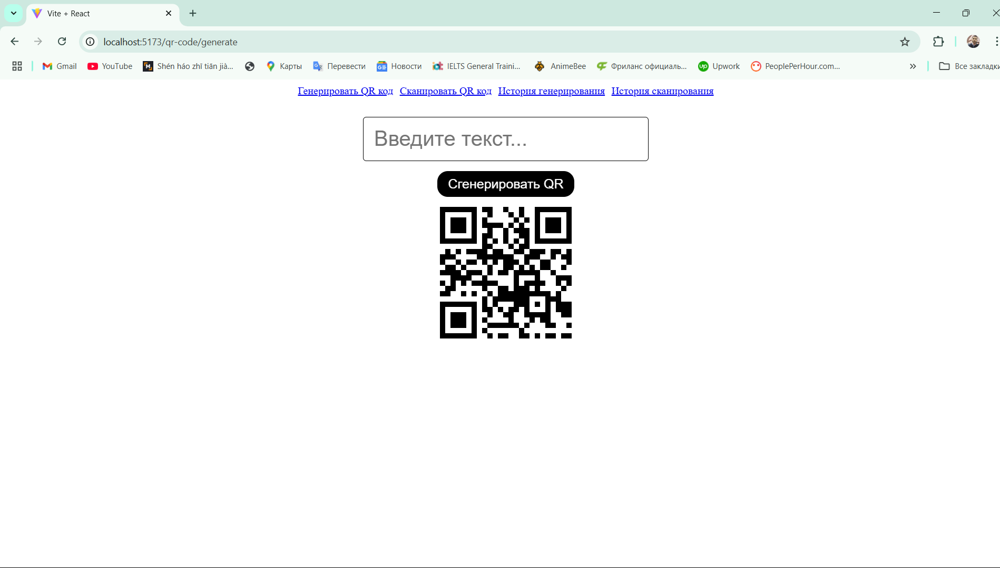

# QR Code Generator and Scanner Application

This is a simple React-based application that allows users to generate and scan QR codes. The application also keeps a history of generated and scanned QR codes, which can be viewed later.

# Features

Generate QR Codes: Users can input text and generate a corresponding QR code.

Scan QR Codes: Users can scan QR codes using their device's camera.

History: The application maintains a history of both generated and scanned QR codes.

Navigation: Easy navigation between different sections of the application using a navigation bar.

# Components

1. **QrCodeGenerator**
   Allows users to input text and generate a QR code.

The generated QR code is displayed on the screen.

The generated text is saved in the local storage for history.

2. **QrCodeScanner**
   Uses the device's camera to scan QR codes.

Displays the scanned text on the screen.

The scanned text is saved in the local storage for history.

3. **GenerateHistory**
   Displays a list of all previously generated QR codes.

Each entry includes the text and the corresponding QR code.

4. **ScanHistory**
   Displays a list of all previously scanned QR codes.

Each entry includes the text and the corresponding QR code.

5. **Navigation**
   Provides links to navigate between different sections of the application:

Generate QR Code

Scan QR Code

Generate History

Scan History
(image.png)

6. # Layout
   The main layout component that includes the navigation bar and routes to different components.
